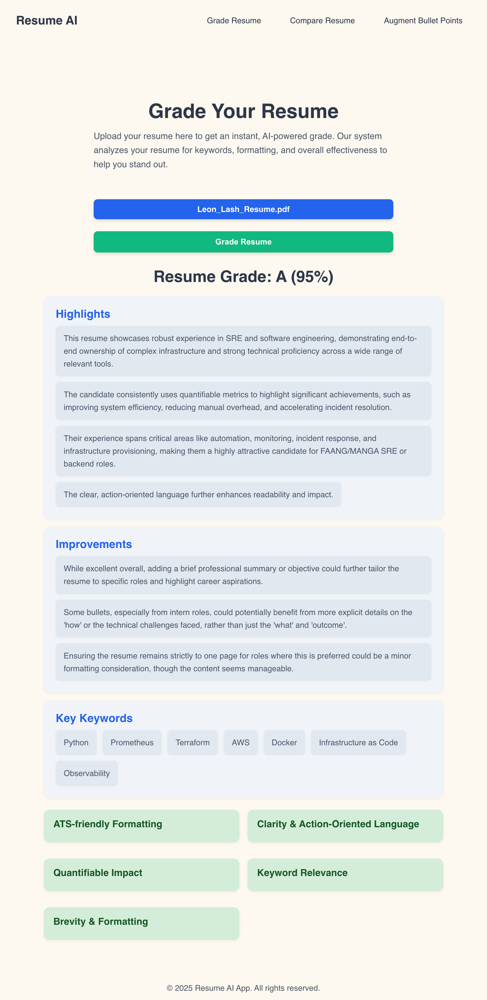

# Your Awesome Resume Grader Frontend!

Hey there! This is the frontend part of our cool Resume Grader app, built with SvelteKit. It's super easy to use and helps you shine!



## What it Does ✨

- **Grade Your Resume:** Upload your resume (PDF, Word docs work too!) and get an instant AI-powered grade. See your score and what makes your resume awesome.
- **Deep Dive Analysis:** We'll break down your resume's highlights, suggest improvements, and show you the key keywords recruiters are looking for.
- **Smart Feedback:** Get clear feedback on things like formatting (ATS-friendly!), how clear and action-oriented your language is, if you're showing enough impact with numbers, and how well your keywords match.
- **Bullet Point Booster:** Got some bullet points that need a little extra oomph? Our AI will whip up stronger, more impactful versions for you.
- **Job Matchmaker:** Upload your resume and paste a job description. We'll show you how well you match, point out any skill gaps, and give you personalized tips.
- **Super Easy to Use:** We designed it to be super intuitive and friendly.
- **Looks Great Everywhere:** Works perfectly on your phone, tablet, or desktop.
- **Friendly Messages:** No annoying pop-ups, just helpful little messages when you need them.

## How We Built It 🛠️

- **SvelteKit:** Our go-to for building snappy web apps.
- **Svelte:** Makes the magic happen behind the scenes, keeping things fast and smooth.
- **HTML & CSS:** The basics for making it look good and work right.
- **JavaScript:** The brains of the operation, handling all the cool features.
- **Talks to a Backend:** All the smart AI stuff happens on a separate backend service that this frontend chats with.

## Get It Running Locally (for Devs) 🧑‍💻

Want to tinker with it on your machine? Here's how!

### What You'll Need

- Node.js (grab the latest stable version)
- npm or Yarn (we usually use npm)

### Quick Start

1. **Grab the code:**

```bash
git clone https://github.com/your-username/sveltekit-resume-grader-frontend.git
cd sveltekit-resume-grader-frontend
```

2. **Install the goodies:**

```bash
npm install
```

3. **Tell it where your backend lives:** Create a `.env` file right in the main folder of this project.

```env
# .env
PUBLIC_API_BASE_URL="http://localhost:8000"
```

_Heads up: Change `http://localhost:8000` to wherever your backend API is running, especially if it's deployed somewhere!_

4. **Fire it up!**

```bash
npm run dev
```

You should see it live at `http://localhost:5173` (or maybe a different port if that one's busy).

## Ready for the World (Deployment) 🚀

This SvelteKit app is a "static" frontend, meaning it just serves up files and then talks to your separate backend API.

1. **Build it for production:** Make sure you've got `@sveltejs/adapter-static` set up in your `svelte.config.js` with `fallback: 'index.html'`.

```bash
npm run build
```

This creates all the ready-to-go files in the `build/` folder.

2. **Pick a hosting spot:** You can deploy that `build/` folder to almost any static site host. We really like:
   - **AWS S3 + CloudFront (Our Top Pick!):** Super fast, global, and secure (HTTPS!).
   - Netlify
   - Vercel
   - GitHub Pages

**Super Important:** Before you build for deployment, double-check that your `PUBLIC_API_BASE_URL` in your `.env` (or wherever your deployment environment stores variables) is pointing to your _live, deployed_ backend API URL!

## How to Use It (The Fun Part!) 🎉

Once your app is live:

1. **Pick a feature:** Just click around to "Grade Resume," "Augment Bullet Points," or "Compare Resume to Job Application."
2. **Give it some info:**
   - For grading or comparing, upload your resume.
   - For bullet points, just type or paste them in.
   - For comparing, paste the job description too.
3. **Click the button!** Hit "Grade Resume," "Enhance Bullet Point," or "Compare Resume."
4. **See the magic:** Your results will pop right up!

## A Quick Word on API Keys 🔑

Just a friendly reminder: If your backend API uses any super-secret API keys to talk to other services (like AI models), those keys should **NEVER** be in this frontend code. They need to live securely on your backend server (think AWS Lambda environment variables or a secrets manager). This frontend only talks to your backend's public-facing endpoints. Stay safe out there!

---

_Happy resume grading! 🎯_
